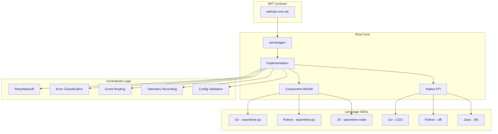

# Core Architecture Decisions

This document provides architectural guidance for the EDA Functions SDK shared Rust core, covering what logic should be centralized, type system design using WIT interfaces, and recommended approaches for cross-language integration.

---

## 1. What Additional Logic Should Go in the Shared Core?

### Current State

The Rust core currently provides minimal functionality - static config getters and noop stubs for retry/routing. This provides **no real code reuse** since the SDK wrappers could trivially implement the same logic.

### Recommended Additional Logic

With WIT interfaces enabling rich types, significantly more logic can be centralized.

#### Priority 1: Core Decision Logic

| Logic | Benefit |
|-------|---------|
| **Exponential Backoff** | Real algorithm with jitter, not just `return 0` |
| **Error Classification** | Categorize errors as retryable, permanent, rate-limited, etc. |
| **Retry Decision** | Complex retry policy with max attempts, backoff caps |
| **DLQ Decision** | Dead-letter policy based on error type and attempt count |
| **Event Routing** | Pattern-based routing with wildcard support |

#### Priority 2: Configuration Management

| Logic | Benefit |
|-------|---------|
| **Config Parsing** | Validate YAML/JSON, normalize values, apply defaults |
| **Schema Validation** | Ensure required fields, valid ranges |
| **Environment Override** | Merge environment variables into config |

#### Priority 3: Telemetry (Expanded)

Telemetry is an excellent candidate for the shared core because:

1. **Consistent naming** - All SDKs use identical metric names
2. **Standard labels** - Same dimensions across languages
3. **Aggregation logic** - Histograms, percentiles computed identically
4. **Semantic conventions** - OpenTelemetry-compatible naming

| Telemetry Function | Description |
|-------------------|-------------|
| **Metric Definitions** | Define all metric names, types, descriptions, and label keys |
| **Event Counting** | Track events processed, failed, retried |
| **Latency Recording** | Compute histogram buckets for processing time |
| **Error Counting** | Count errors by category |
| **Batch Statistics** | Track batch sizes, processing times |
| **Queue Depth** | Gauge for consumer lag |
| **Retry Statistics** | Count retries by attempt number |
| **DLQ Statistics** | Track dead-lettered events |

The core would define metrics and compute values, but actual emission (to Prometheus, OTLP, etc.) remains in SDKs since it requires I/O.

**Example metric definitions the core would provide:**

| Metric Name | Type | Labels |
|-------------|------|--------|
| `eda_events_processed_total` | Counter | `event_type`, `handler`, `status` |
| `eda_event_processing_duration_seconds` | Histogram | `event_type`, `handler` |
| `eda_retry_attempts_total` | Counter | `event_type`, `attempt` |
| `eda_dlq_events_total` | Counter | `event_type`, `reason` |
| `eda_batch_size` | Histogram | `handler` |
| `eda_consumer_lag` | Gauge | `topic`, `partition` |

The SDK would call core functions like:
- `record-event-processed(event-type, handler, duration, success)` 
- `record-retry-attempt(event-type, attempt-number)`
- `get-metric-snapshot()` → returns all current metric values

This ensures all language SDKs report identical metrics with identical semantics.

#### Priority 4: Event Validation

| Logic | Benefit |
|-------|---------|
| **CloudEvent Validation** | Verify required fields, valid types per spec |
| **Extension Validation** | Custom validation rules for extensions |
| **Schema Registry** | Cache and validate against registered schemas |

### What Should Stay in Language SDKs

| Component | Reason |
|-----------|--------|
| Kafka client | Native libraries are mature and optimized |
| CloudEvents parsing | Existing CE SDKs handle serialization |
| Handler invocation | Language-specific function calling |
| Framework integration | Spring, Quarkus, Flask differ significantly |
| Metric emission | Requires I/O to Prometheus/OTLP endpoints |
| Logging | Each language has idiomatic logging |

---

## 2. WIT Interface Design

### Recommended Approach

Define interfaces in WIT (WebAssembly Interface Types) format. The WIT file serves as the API contract between the Rust core and all language SDKs.

**Key interfaces to define:**

| Interface | Exports |
|-----------|---------|
| `types` | Records for `kafka-config`, `error-info`, `retry-decision`, etc. |
| `config` | `get-kafka-config`, `parse-config` |
| `retry` | `classify-error`, `should-retry`, `calculate-backoff`, `should-dlq` |
| `routing` | `route-event`, `add-route`, `clear-routes` |
| `telemetry` | `record-event`, `record-error`, `get-metrics`, `get-metric-definitions` |

### Benefits of WIT Approach

| Benefit | Description |
|---------|-------------|
| **Rich Types** | Records, enums, variants, lists - not just primitives |
| **Type Safety** | Compile-time checking across language boundary |
| **Self-Documenting** | WIT file serves as API contract |
| **Versioning** | Package versioning built-in |
| **Language Agnostic** | Generate bindings for any supported language |
| **Composability** | Components can import/export interfaces |

---

## 3. WASM Approach Decision: Component Model with WIT

### The Problem

Current implementation uses `wasm-bindgen` which generates JavaScript glue code incompatible with pure WASM runtimes like wazero.

### Decision: Adopt WASM Component Model

The WASM Component Model with WIT interfaces is the recommended approach.

### Runtime Support Matrix

| Runtime | Component Model | Language | CGO Required |
|---------|----------------|----------|--------------|
| **wasmtime** | ✅ Full support | Rust, C | N/A |
| **wasmtime-go** | ✅ Full support | Go | ✅ Yes |
| **wasmtime-py** | ✅ Full support | Python | ❌ No |
| **wasmtime (Node.js)** | ✅ Full support | JavaScript | ❌ No |
| **wazero** | ❌ Core WASM only | Go | ❌ No |
| **Chicory** | ⚠️ Experimental | Java | ❌ No |

### Trade-off: wazero vs wasmtime-go

| Aspect | wazero | wasmtime-go |
|--------|--------|-------------|
| CGO | Not required | Required |
| Component Model | ❌ Not supported | ✅ Full support |
| WIT support | ❌ None | ✅ Full |
| Build complexity | Simple | Needs Rust toolchain |
| Runtime performance | Good | Excellent (native JIT) |
| Cross-compilation | Easy | Complex |

### Recommendation

**Accept the CGO trade-off for wasmtime-go** because:

1. Component Model enables rich types - major DX improvement
2. WIT provides a clear API contract
3. wasmtime is battle-tested with security fixes
4. The alternative (wazero) requires primitive-only interface

---

## 4. FFI Linking Approach Decision

### The Problem

Current Go FFI uses relative paths that break portability when the package is imported via `go get`.

### Recommendation: Hybrid Approach

| Environment | Approach |
|-------------|----------|
| **Development** | Makefile sets `LD_LIBRARY_PATH` to local build |
| **Distribution** | pkg-config file installed to system paths |
| **Container** | Library copied to `/usr/lib/` in image |
| **Static builds** | Link against `staticlib` for self-contained binary |

Using build tags, the Go FFI can switch between development (relative paths) and production (pkg-config) modes.

---

## 5. Concrete Next Steps

### Phase 1: Define WIT Interface

- Create `wit/` directory at repository root
- Write `wit/eda-core.wit` with interfaces for config, retry, routing, telemetry
- Define rich types as records and enums

### Phase 2: Implement Rust Core with WIT

- Add `wit-bindgen` to WASM bindings
- Implement exported interfaces with real algorithms
- Build with `wasm32-wasip2` target

### Phase 3: Update Go SDK to wasmtime-go

- Replace wazero with wasmtime-go
- Generate Go bindings from WIT using wit-bindgen-go
- Update WASM wrapper to use Component API

### Phase 4: Update Other SDKs

- Python: wasmtime-py with Component Model
- JavaScript: wasmtime Node.js bindings
- Java: Evaluate Chicory Component support, fallback to JNI

### Phase 5: Implement Core Logic

- Exponential backoff with jitter
- Error classification heuristics  
- Pattern-based event routing
- Telemetry recording and aggregation

---

## Summary

| Decision | Recommendation | Rationale |
|----------|---------------|-----------|
| **Interface Definition** | WIT | Rich types, versioning, language-agnostic |
| **WASM Approach** | Component Model | Enables structured data, type safety |
| **Go Runtime** | wasmtime-go | Full Component Model support |
| **Trade-off Accepted** | CGO dependency | Worth it for rich type support |
| **Core Logic** | Centralize algorithms + telemetry | Real code reuse value |
| **FFI Linking** | pkg-config + env fallback | Flexible for dev/prod |

### Architecture After Implementation

The WIT-based approach with centralized telemetry provides:
- **Single source of truth** for API contracts and metric definitions
- **Consistent observability** across all language SDKs
- **Rich types** across all language boundaries  
- **Future-proof** alignment with WebAssembly standards
