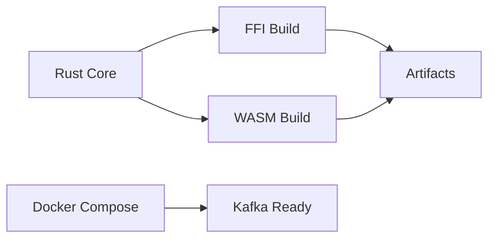
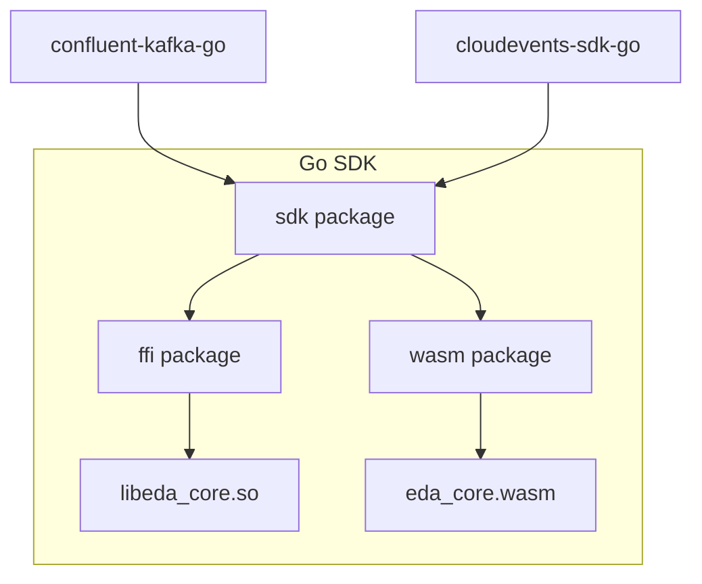
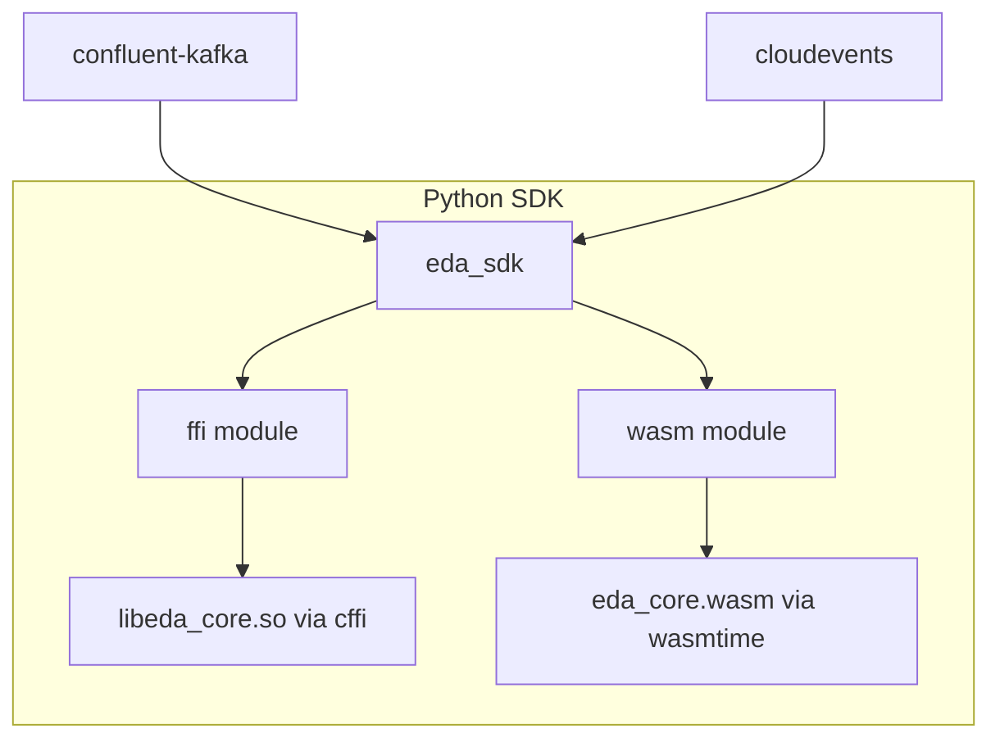
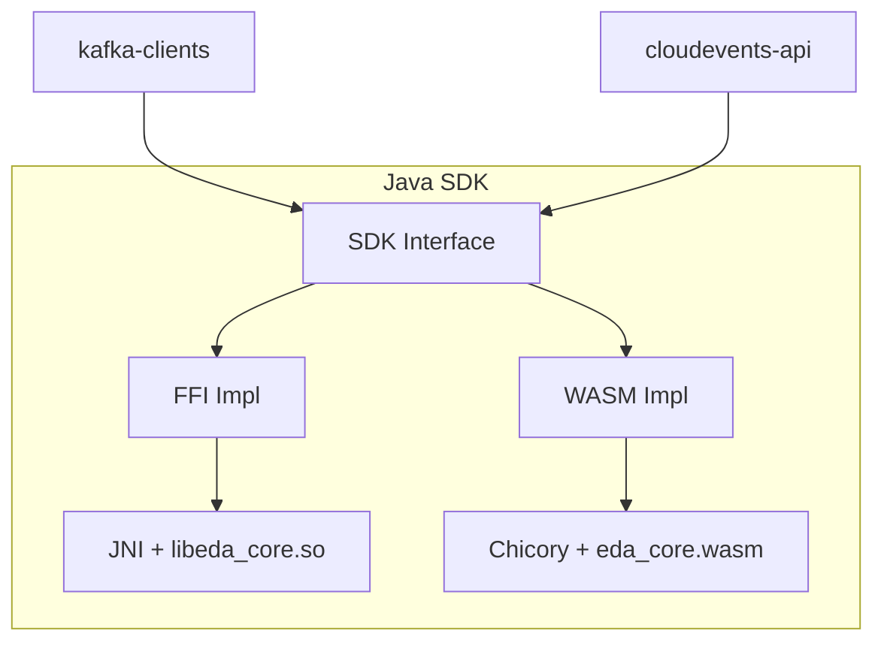
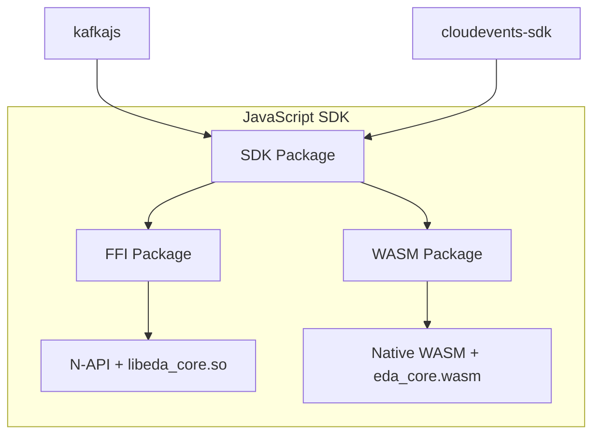

# EDA Functions SDK - PoC Implementation Plan

## Overview

This plan implements both FFI and WASM approaches for a multi-language EDA SDK, supporting Go, Python, Java, and JavaScript/TypeScript. The goal is to validate the architecture and identify roadblocks.

## Target Developer Experience

Each language SDK should enable this simple pattern:

```go
// Go
func Handle(event cloudevents.Event) error {
    fmt.Printf("Received: %s\n", event.Type())
    return nil
}
```

```python
# Python
def handle(event: CloudEvent) -> None:
    print(f"Received: {event['type']}")
```

```java
// Java
public class Handler implements EventHandler {
    public void handle(CloudEvent event) {
        System.out.println("Received: " + event.getType());
    }
}
```

```typescript
// TypeScript
export function handle(event: CloudEvent): void {
    console.log(`Received: ${event.type}`);
}
```

---

## Directory Structure

```
func-eda-mlang/
├── core/                           # Rust shared core
│   ├── Cargo.toml
│   └── src/
│       ├── lib.rs                  # Main exports
│       ├── config.rs               # Kafka config parsing
│       ├── retry.rs                # Retry/backoff logic
│       └── routing.rs              # Event routing
│
├── bindings/
│   ├── ffi/                        # FFI artifacts
│   │   ├── build.rs                # Build script for .so/.dylib
│   │   └── include/                # C headers (cbindgen)
│   └── wasm/                       # WASM artifacts
│       └── Cargo.toml              # WASM build config
│
├── sdks/
│   ├── go/
│   │   ├── pkg/
│   │   │   ├── sdk/                # Main SDK interface
│   │   │   ├── ffi/                # FFI wrapper
│   │   │   └── wasm/               # WASM wrapper
│   │   ├── examples/
│   │   │   ├── ffi-consumer/
│   │   │   └── wasm-consumer/
│   │   └── go.mod
│   │
│   ├── python/
│   │   ├── eda_sdk/
│   │   │   ├── __init__.py
│   │   │   ├── ffi/                # FFI wrapper (cffi)
│   │   │   └── wasm/               # WASM wrapper (wasmtime)
│   │   ├── examples/
│   │   │   ├── ffi_consumer.py
│   │   │   └── wasm_consumer.py
│   │   └── pyproject.toml
│   │
│   ├── java/
│   │   ├── sdk/
│   │   │   └── src/main/java/
│   │   │       └── io/openshift/eda/
│   │   │           ├── ffi/        # JNI wrapper
│   │   │           └── wasm/       # Chicory wrapper
│   │   ├── examples/
│   │   └── pom.xml
│   │
│   └── javascript/
│       ├── packages/
│       │   ├── sdk/                # Main SDK
│       │   ├── ffi/                # N-API wrapper
│       │   └── wasm/               # Native WASM wrapper
│       ├── examples/
│       └── package.json
│
├── infra/
│   ├── docker-compose.yml          # Kafka, Zookeeper
│   └── scripts/
│       └── send-test-event.sh      # Send CloudEvents to Kafka
│
├── Makefile                        # Top-level orchestration
├── docs/
│   └── research/
│       └── approaches.md
└── README.md
```

---

## Implementation Phases

### Phase 1: Infrastructure & Core



#### Tasks

1. Set up Docker Compose with Kafka + Zookeeper
2. Create Makefile with targets for build, test, run
3. Implement Rust core with static/mock logic:
   - `get_kafka_config()` - returns hardcoded broker/topic/group
   - `should_retry(error, attempt)` - returns false (noop)
   - `calculate_backoff(attempt)` - returns 0
   - `route_event(type)` - returns handler_id 0
4. Set up FFI build (cbindgen for C headers)
5. Set up WASM build (wasm32-unknown-unknown target)

---

### Phase 2: Go SDK



#### FFI Approach
- Use cgo to call Rust shared library
- Link against `libeda_core.so`

#### WASM Approach
- Use wazero (pure Go, zero dependencies)
- Load `eda_core.wasm` at startup

#### Tasks
1. Create Go module structure
2. Implement FFI bindings with cgo
3. Implement WASM bindings with wazero
4. Create unified SDK interface
5. Build example consumer for each approach
6. Test with Docker Compose Kafka

---

### Phase 3: Python SDK



#### FFI Approach
- Use cffi for native library bindings
- Load shared library at runtime

#### WASM Approach
- Use wasmtime-py
- Load WASM module at startup

#### Tasks
1. Create Python package structure with pyproject.toml
2. Implement FFI bindings with cffi
3. Implement WASM bindings with wasmtime-py
4. Create unified SDK interface
5. Build example consumer for each approach
6. Test with Docker Compose Kafka

---

### Phase 4: Java SDK



#### FFI Approach
- Use JNI (Java Native Interface)
- Consider JNA as simpler alternative

#### WASM Approach
- Use Chicory (pure Java WASM runtime, no GraalVM required)
- Alternative: GraalWasm for GraalVM environments

#### Tasks
1. Create Maven project structure
2. Implement FFI bindings with JNI or JNA
3. Implement WASM bindings with Chicory
4. Create unified SDK interface
5. Build example consumer for each approach
6. Test with Docker Compose Kafka

---

### Phase 5: JavaScript/TypeScript SDK



#### FFI Approach
- Use N-API with node-addon-api
- Alternative: ffi-napi for simpler bindings

#### WASM Approach
- Native V8 WASM support (no external runtime needed)
- Works in both Node.js and browsers

#### Tasks
1. Create npm workspace structure
2. Implement FFI bindings with N-API or ffi-napi
3. Implement WASM bindings with native WebAssembly API
4. Create unified SDK interface
5. Build example consumer for each approach
6. Test with Docker Compose Kafka

---

### Phase 6: Comparison & Documentation

#### Tasks
1. Document build complexity for each approach
2. Measure binary/artifact sizes
3. Test debugging experience
4. Document any roadblocks encountered
5. Write comparison report
6. Update README with getting started guide

---

## Makefile Targets

```makefile
# Infrastructure
make kafka-up          # Start Kafka via Docker Compose
make kafka-down        # Stop Kafka
make kafka-logs        # View Kafka logs

# Core
make core-build-ffi    # Build Rust core as shared library
make core-build-wasm   # Build Rust core as WASM module

# SDKs
make sdk-go-ffi        # Build Go SDK with FFI
make sdk-go-wasm       # Build Go SDK with WASM
make sdk-python-ffi    # Build Python SDK with FFI
make sdk-python-wasm   # Build Python SDK with WASM
make sdk-java-ffi      # Build Java SDK with FFI
make sdk-java-wasm     # Build Java SDK with WASM
make sdk-js-ffi        # Build JavaScript SDK with FFI
make sdk-js-wasm       # Build JavaScript SDK with WASM

# Examples
make example-go-ffi    # Run Go FFI example
make example-go-wasm   # Run Go WASM example
# ... similar for other languages

# Testing
make test-send-event   # Send test CloudEvent to Kafka
make test-all          # Run all SDK tests

# All
make all               # Build everything
make clean             # Clean all artifacts
```

---

## Dependencies Summary

| Language | FFI Library | WASM Runtime | Kafka Client | CloudEvents SDK |
|----------|------------|--------------|--------------|-----------------|
| Rust Core | cbindgen | wasm-bindgen | - | - |
| Go | cgo (builtin) | wazero | confluent-kafka-go | cloudevents-sdk-go |
| Python | cffi | wasmtime-py | confluent-kafka | cloudevents |
| Java | JNI/JNA | Chicory | kafka-clients | cloudevents-api |
| JavaScript | N-API/ffi-napi | Native V8 | kafkajs | cloudevents-sdk |

---

## Risk Assessment

| Risk | Mitigation |
|------|------------|
| Platform-specific FFI builds | CI matrix for Linux/macOS/Windows x86/ARM |
| JNI complexity | Consider JNA as simpler alternative |
| Chicory maturity | GraalWasm as fallback |
| Debug experience with FFI/WASM | Document workarounds, provide logging |

---

## Success Criteria

1. All 4 languages can consume CloudEvents from Kafka using both FFI and WASM
2. Developer experience is clean (minimal boilerplate)
3. Build process is automated via Make
4. No major roadblocks identified (or documented workarounds)
5. Comparison document with findings
